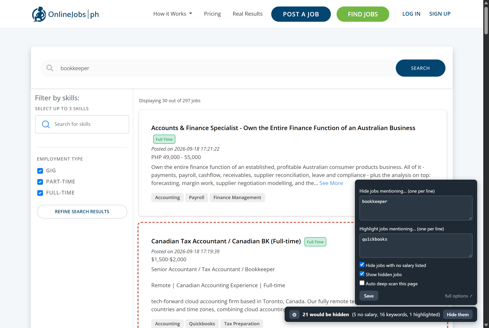
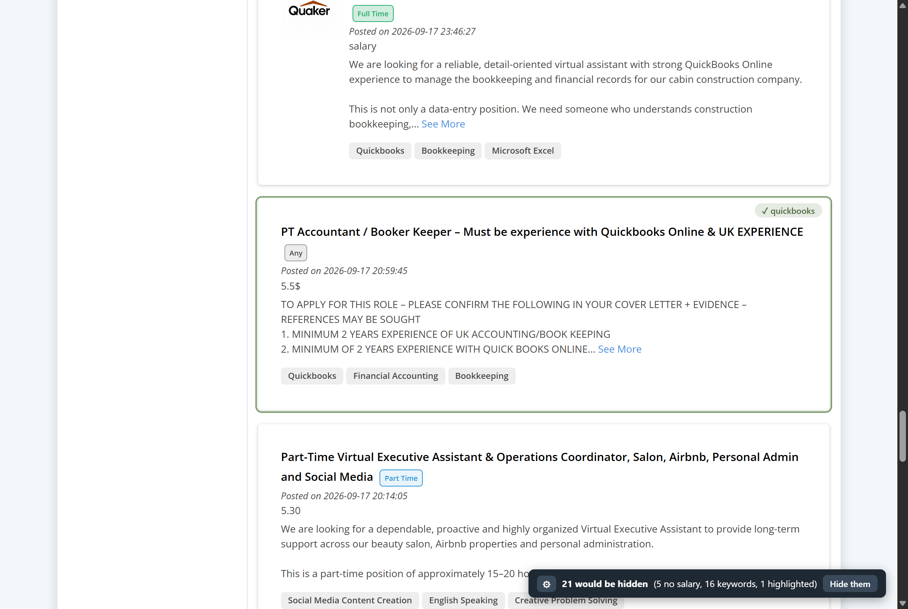

# OJ.ph Cleaner

A Chrome extension that cleans up [OnlineJobs.ph](https://www.onlinejobs.ph) job-search pages.
It hides listings that are a waste of your time — no salary listed, or a keyword you never want to
read again — and highlights the ones you do, without ever taking a listing away for a positive
match. Everything runs on your machine: no account, no server, no analytics.


No-salary jobs and negative keywords are gone; the chip in the bottom-right says exactly what it did
and offers one click to see everything it removed — a keyword-hidden card comes back with a red
dashed marker, so the decision stays yours:



Positive keywords never hide anything. They mark the card with a green outline and a `✓ keyword`
badge, so a job you want floats to the top of your attention instead of disappearing by mistake:



## Install

There is no store listing yet (`spec.md` D2). Load it unpacked:

1. Download or clone this repository.
2. Open `chrome://extensions` and turn on **Developer mode** (top right).
3. Click **Load unpacked** and pick this folder.
4. Open a search on OnlineJobs.ph — a chip appears in the bottom-right corner.

Chrome remembers an unpacked extension after a restart. After editing files, press **Reload** on the
extension card to pick the changes up.

## What it does

Three rules, applied in this order to every listing on the page:

1. **No salary → hidden.** The salary field must contain a digit. `TBD`, `N/A`, `Negotiable`, `DOE`
   and an empty field all fail.
2. **Negative keyword → hidden.** Case-insensitive substring match against the whole card.
3. **Positive keyword → highlighted only.** Never hidden. The green outline and `✓ keyword` badge
   tell you why.

The first rule that matches wins, which matters when you read a count: with *no salary* turned off,
a no-salary card that also matches a negative keyword moves into the keyword bucket.

The chip reports `N hidden (x no salary, y keywords, z highlighted)` and toggles between hiding and
showing. Click `⚙` to open the settings panel **in the page** — saving applies to the listings
immediately, with no reload.

## Settings

Click `⚙` on the chip, or use the standalone options page if you prefer a full tab. Both write the
same storage, and both take effect on every open tab immediately.

| Setting | Default | Meaning |
|---|---|---|
| `negative` | empty | One keyword per line. A listing whose text contains any of them is **hidden**. |
| `positive` | empty | One keyword per line. A listing whose text contains any of them is **highlighted**, never hidden. |
| `noSalary` | on | Hide listings whose salary field contains no digit (`TBD`, `N/A`, `Negotiable`, `DOE`, empty). |
| `showHidden` | off | Reveal what was hidden, with a red dashed marker. The chip's `Show all` writes this. |
| `autoScan` | off | Deep-scan this page's listings once the described feature ships — **disabled in the UI until then** (`spec.md` W3). |

Matching is plain case-insensitive substring, so `crypto` also matches `cryptocurrency`. Keep the
list short and specific.

## Privacy

- **Zero requests while nothing is configured.** With empty keyword lists and `noSalary` off, the
  extension does not talk to anything.
- **One site.** The content script is injected only on `onlinejobs.ph`; the host permission exists to
  read that page's listing DOM.
- **Local state.** Keywords and toggles live in `chrome.storage.local` on your machine. There is no
  server, no account, no analytics, and no third-party call. See `SECURITY.md`.
- **No crawling.** Even the planned deep scan is bounded to the cards already on the page you are
  looking at — it never paginates (`docs/scraping.md`).

## Development

No dependencies, no build step. Node ≥ 18 is only needed for the checks.

```bash
npm test                      # rules + manifest integrity (zero dependencies)
sh tools/gate.sh              # the full gate: syntax, tests, hygiene, README truth, path scan
```

`tools/verify-live.mjs` is the check that actually matters — it reloads the extension in a real
Chrome over CDP, loads the live site, recomputes the expected result from the DOM and compares:

```bash
# bring up the automation Chrome once (see docs/HANDOFF.md §2)
"/c/Program Files/Google/Chrome/Application/chrome.exe" \
  --user-data-dir="C:/Users/PC/AppData/Local/agent-chrome-profile" \
  --remote-debugging-port=9333 --no-first-run --no-default-browser-check about:blank &

node tools/verify-live.mjs
node tools/verify-live.mjs --url="https://www.onlinejobs.ph/jobseekers/jobsearch?jobkeyword=bookkeeper" \
     --neg=bookkeeper --pos=quickbooks
```

Unit tests cannot see a missing permission or a renamed selector; that harness can, and it asserts
the chip's counts, the `[hidden]` cards really being `display:none`, the show-all/re-hide toggle, and
that saving settings repaints the list without a reload.

## Files

| Path | Purpose |
|---|---|
| `manifest.json` | MV3 manifest: `storage` permission, `onlinejobs.ph` host permissions, content script |
| `rules.js` | Pure rules — `hasSalary`, `matchKeywords`. No DOM, so it is unit-tested directly |
| `content.js` | The content script: chip, in-page settings panel, rule pass, DOM observer, storage sync |
| `content.css` | Styles for the chip, the panel and the highlight badge (all `#ojc-*` scoped) |
| `options.html` / `options.js` | Standalone options page (the in-page panel is the primary UI) |
| `test-rules.js` / `test-manifest.js` | Node tests, zero dependencies |
| `test-repo-hygiene.js` | Repo invariants (license stance, required files, hook wiring) |
| `tools/gate.sh` | One command: syntax + tests + hygiene + README truth + personal-path scan |
| `tools/check-readme.js` | Keeps this file true: every setting documented, no stale counts |
| `tools/verify-live.mjs`, `tools/cdp.mjs` | Live end-to-end check against the real site over CDP |
| `docs/architecture.md` | How the pieces fit; the invariants that must not regress |
| `docs/scraping.md` | What it fetches, when, and the politeness budget |
| `docs/HANDOFF.md` | Runbook: environment, traps, resume commands |
| `spec.md` | Audit, verified defects, decisions and the wave plan |

## License

Copyright (c) 2026 Jeyson Anki. **All rights reserved.** This repository is public to read, but no
open-source license is granted: the absence of a `LICENSE` file is deliberate, and no reuse is
permitted without written permission.
