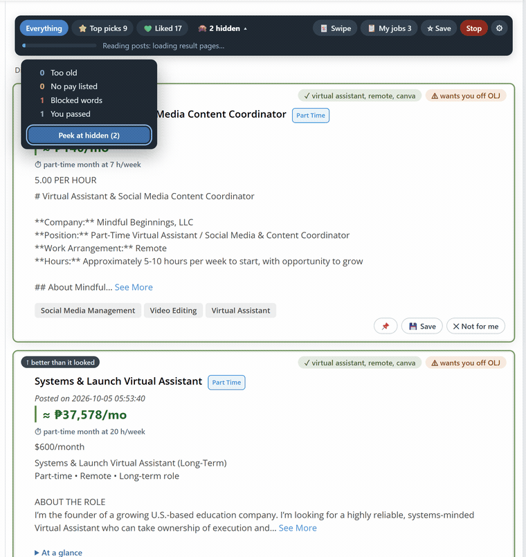
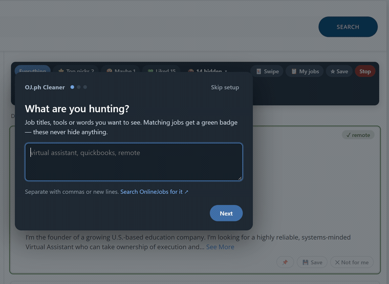
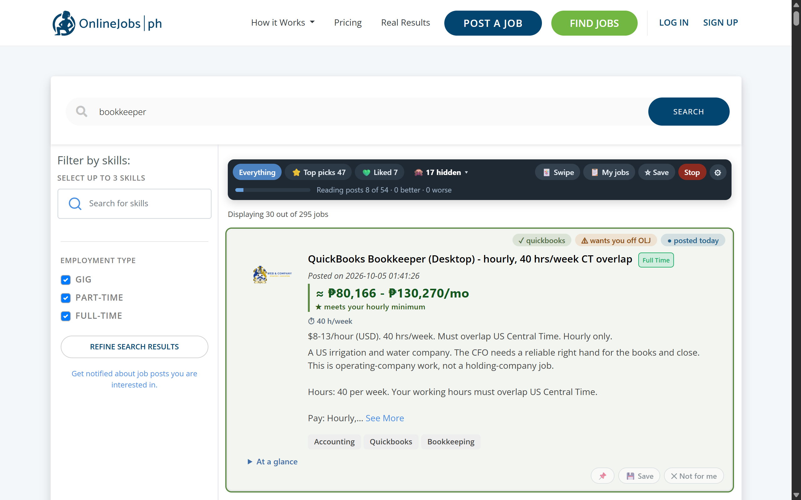
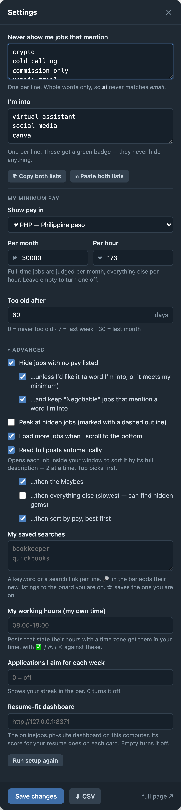
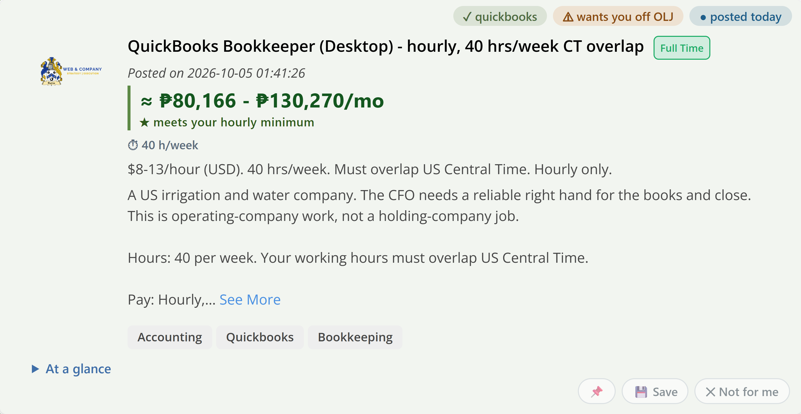
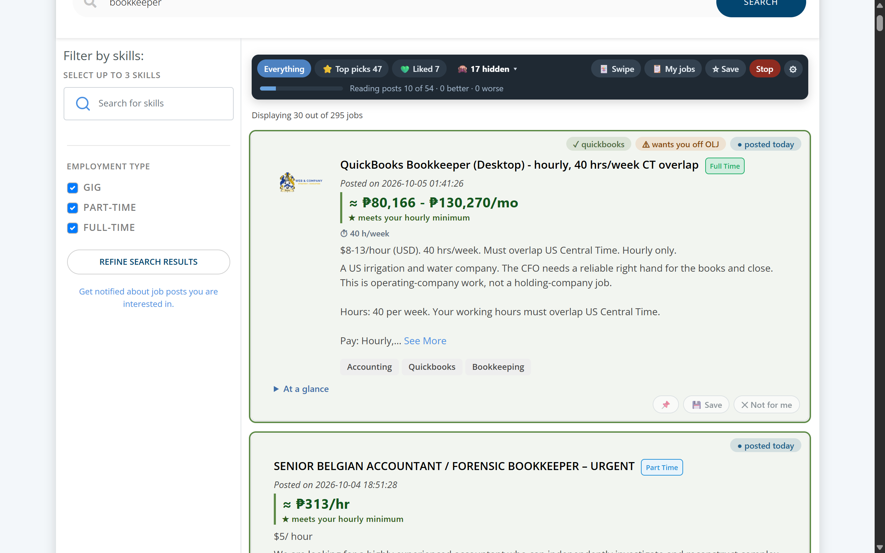
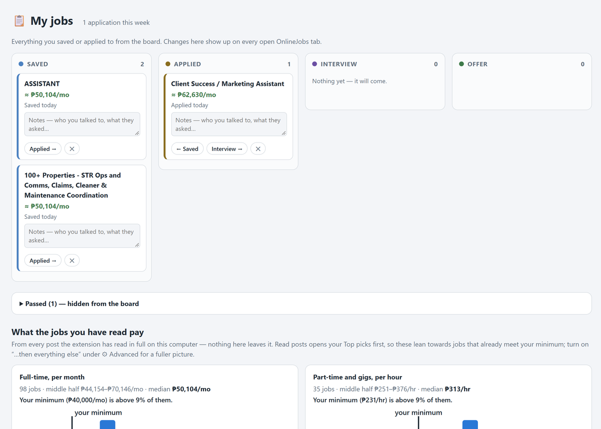

<div align="center">


# OJ.ph Cleaner

**The filter OnlineJobs.ph doesn't ship.**

A Chrome extension that hides the listings that waste your time, marks the ones you'd want,<br>
turns every salary into one comparable number, and remembers your calls so tomorrow starts where today left off.


[Install](#install) ·
[Tour](#the-tour) ·
[How it decides](#how-it-decides) ·
[Settings](#settings) ·
[Privacy](#privacy) ·
[Full guide](docs/guide.md)



</div>

## Why it exists

The board gives you a list and no way to narrow it. The facts that decide whether a listing is
worth your time (*does it pay, is it fresh, is it the kind of work you want*) are free text inside
the card, or inside a description you have to open. Salaries aren't comparable (`5.5$/hr` next to
`Php 1000/day` next to `TBD`), staleness is invisible until you're pages deep (a 297-job search
measured **40 to 46 days old**), and the board remembers nothing, so the same judgement gets paid for
again tomorrow.

**[The six problems it attacks, and the place it refuses to guess](PROBLEMS.md)**

## The tour

### Set up in three screens

A fresh install asks three skippable questions: what you're hunting, the least you'd take, and
your instant no's. Finish replaces only what you answered, and offers Undo.



### One bar that says what it did

A slim bar sits on top of the site's own results. Pills filter to **⭐ Top picks**, **🤔 Maybe** or
**💚 Liked** without reordering anything. `🙈 N hidden ▾` breaks the hidden count down by reason, and
*Peek at hidden* brings them back with a red dashed outline, so the decision stays yours.

| The bar and its counts | Settings, in place |
|---|---|
|  |  |

### Read posts: every listing judged on its full description

A card only carries a title and a salary line. `Read posts` loads every result inside your recency
window, then opens each listing, two at a time, and re-decides it against the full post: the word
the card never mentioned, the stated hours, the ask to move off the platform. Cards that moved get
`↑ better than it looked` or `↓ worse than it looked`, and the board ends ranked by pay.


### Pay you can compare

`5.5$/hr`, `Php 1000/day`, `15-20 AUD per hour` and `PHP 49,000 - 55,000` become one figure in
pesos or dollars, at the ECB's reference rate. A month is only claimed when the listing supports
one, and a string the parser can't read gets no number rather than a guess. Jobs at or above your
minimum light up; trust tags flag what deserves a second look.



Words you're into never hide anything. They mark the card with a green outline and a `✓ word`
badge, so a job you want stands out instead of disappearing by mistake:



### Swipe through the shortlist

`🃏 Swipe` walks the board one card at a time: `→` save, `←` not for me, `↑` applied, `Enter`
open the post, `Z` undo. *At a glance* shows what you'd do and what they want, lifted word for word
from the post.


### My jobs

Everything you saved or applied to, on a Saved, Applied, Interview, Offer board with a note per
job, a follow-up nudge after five quiet days, an optional weekly streak, and pay insights built from
every post the extension has read on your machine.



**Also on board:** a `⚠ risky N` score with every reason on hover, `🔁 posted N× in 30 days`, a
post's stated hours converted to your time zone, `📌` compare up to three cards side by side, saved
searches merged into one board, suggested block words learned from what you pass, `● new since
last visit`, and a CSV export of everything it remembers. All of it is tags, never gates: none of
it hides a listing or changes its tier. **[Every feature in detail](docs/guide.md#your-own-calls-triage-my-jobs-and-the-rest)**

## Install

There is no store listing yet (`spec.md` D2). Load it unpacked:

1. Download or clone this repository.
2. Open `chrome://extensions` and turn on **Developer mode** (top right).
3. Click **Load unpacked** and pick this folder.
4. Open a search on OnlineJobs.ph. The three-screen setup comes first, then the bar appears at the
   top of the results.

Chrome remembers an unpacked extension after a restart. After editing files, press **Reload** on the
extension card to pick the changes up.

## How it decides

Four rules, applied in this order to every listing on the page. The first one that matches wins.

1. **Posted too long ago: hidden (*Too old*).** Older than your window (60 days by default).
2. **No pay: hidden (*No pay listed*).** `TBD`, `N/A`, `Negotiable`, `DOE` and an empty field all fail.
3. **A word you block: hidden (*Blocked words*),** matched as an exact word or phrase, unless the
   listing meets your minimum pay, in which case it stays as a 🤔 Maybe.
4. **A word you're into: marked only (*Liked*).** Never hidden, never promoted. Only pay makes a
   listing a ⭐ Top pick.

| You see | What it means |
|---|---|
| **⭐ Top picks** | Meets your minimum pay, and mentions no word you block (or it does, but pays 50 %+ over your minimum) |
| **🤔 Maybe** | Mentions a word you block, but meets your minimum pay: your call |
| **💚 Liked** | Mentions a word you're into, but pays below your minimum |
| **🙈 N hidden** | Why the rest are gone: *Too old*, *No pay listed*, *Blocked words*, *Closed*, *You passed* |

Every word on screen lives in one table, `labels.js`. The tiers, the badges, the salary parser,
`Read posts` and its request budget are explained in full in **[the guide](docs/guide.md)**.

## Settings

Press ⚙ on the bar, or use the standalone options page if you prefer a full tab. Both show the same groups:
**Basics** up front (*Never show me jobs that mention*, *I'm into*, *My minimum pay* (with the currency
picker), *Too old after N days*), and everything else folded under **Advanced** (D47). Both write the same
storage, and both take effect on every open tab immediately. Save applies at once and shows a toast with
one step of Undo (D48).

| Setting | Default | Meaning |
|---|---|---|
| `negative` | a starter list | *Never show me jobs that mention*: one word or phrase per line. A listing whose text contains any of them **as an exact word or phrase** is **hidden** (*Blocked words*), unless it meets your minimum pay (then it is a Maybe). |
| `positive` | a starter list | *I'm into*: one word or phrase per line. A listing whose text contains any of them **as an exact word or phrase** is **marked** (*Liked*), never hidden. |
| `noSalary` | on | *Hide jobs with no pay listed*: the salary field contains no digit (`TBD`, `N/A`, `Negotiable`, `DOE`, empty). |
| `rescueNoSalary` | on | With `noSalary` on: *…unless I'd like it*: a listing with no figure that mentions a word you're into, or meets your minimum, is **shown** instead of hidden. On by default (D42). |
| `rescueNegotiable` | on | With `noSalary` on: a listing that says **Negotiable** or **DOE** and mentions a word you're into is shown with a `⚠ negotiable` tag, instead of hidden. On by default (D42). |
| `maxAgeDays` | 60 | *Too old after* this many days: hide listings posted longer ago. `0` turns it off, `7` the last week, `30` the last month (default: the last two months). Applied **before** every other rule, and a listing whose date cannot be read is never hidden by it. |
| `showHidden` | off | *Peek at hidden*: reveal what was hidden, with a red dashed marker. The bar's `Peek at hidden` / `Hide them again` writes this. |
| `autoLoad` | on | Append the next page of results when you scroll to the bottom of the list. One page per real scroll, one request per page, and it stops at the end of the results. |
| `goalSalary` | 60000 | *My minimum pay*, per month (stored in PHP, shown in your `currency`). Cards whose converted salary is **at least** this much get a green wash and a `★ meets your monthly minimum` line. Judged on the low end of a range: a "maybe" is not a yes. `0` turns it off. |
| `goalHourly` | 1000 | The same, per hour: for listings that post an hourly rate, which a monthly minimum cannot judge. A card is brightened if **either** minimum is met. |
| `autoScan` | on | *Read full posts automatically* as soon as a search page loads. On by default (D42): every run is bounded to the recency window, two listings at a time, with hard caps. The `Read posts` button does the same thing on demand. |
| `scanWorth` | on | *…then the Maybes*: after the Top picks, keep reading into the Maybe listings. Off means a run stops after the Top picks. |
| `scanAll` | off | *…then everything else (slowest — can find hidden gems)*. This is the only pass that can lift a listing that matches no word and no minimum, and it is the most expensive one. |
| `sortByPay` | on | *…then sort by pay, best first*: when a run ends, rank the board by the figure on each card: the highest **monthly** figure first, then listings that post only a rate (per hour or per day), then the ones with no figure at all, which keep the site's own order. A month and an hourly rate are never converted into each other (that would assume a work week), so a ₱5,000/mo listing outranks a ₱500/hr one. The order stays as you scroll more pages in, and only after a run: until then the board is in the site's own newest-first order. |
| `dashboardUrl` | `http://127.0.0.1:8371` | The local dashboard from the sibling repo (`onlinejobs.ph-suite`). Each card gets **fits your resume N/M**, that dashboard's score for your resume against this listing, and the badge is a link that opens the job in the dashboard. Empty turns the bridge off; if nothing is listening there the extension stays silent. The score is the dashboard's, never this extension's: it has no resume and no scorer. |
| `currency` | `PHP` | Which currency every figure and your minimum pay are shown in: `PHP` or `USD` (D66). Only the display changes; every comparison is still made in pesos. The minimums are typed in this currency, and switching it in Settings converts them on the spot at the ECB reference rate (refreshed daily; under $100 keeps cents, larger rounds to whole dollars), so the floor means the same in either; a toast says so. If the dollar rate cannot be fetched, figures stay in pesos and the minimums are not judged rather than judged at a guessed rate. |
| `weeklyApplyGoal` | `0` | How many applications a week you aim for (D64). Above 0, the bar shows your streak (days in a row with an application) and this week's count against the goal; My jobs shows it too. Counted from your own ✓ Applied marks; nothing is sent anywhere. `0` turns it off. |
| `myHours` | empty | Your working hours in your own time zone, like `08:00-18:00` (D59). A post that states its schedule with a time zone (`6:00 AM to 9:00 AM Philippine Time`, `9-5 EST`) gets a tag with those hours converted to your zone (daylight saving included) and ✅ all inside / ⚠ partly / ✗ outside your hours. Without it, the tag still appears whenever the post's zone differs from yours. A range with no zone is never converted. |
| `searches` | empty | Your saved searches (D63), as keywords or search links. ☆ on the bar saves the search you are on; 🔎 adds the new listings from your OTHER saved searches to the board you are on, de-duplicated and each tagged with the search it came from, so several searches read as one list. Only on a button press, one request at a time, ≥ 600 ms apart, at most 10 pages and 300 listings across all of them, stopping at your recency window and at the first HTTP 429. |

Every word is an **exact word or phrase**, case-insensitively: `ai` matches `AI tools` and
`AI-powered` but never `email` or `daily`, and `video editor` does not match `video editors`. Add the
forms you want: the list is read literally, so `editor` and `editors` are two entries. That precision
is deliberate: `AI` as a substring matched **every** listing on a live search, and because a listing
that also looks good is shown as a Maybe rather than hidden, a loose match quietly turns blocking off
altogether.

The two lists can be moved out and back: `Copy lists` puts both on the clipboard in a plain, readable
format (a `# hide` section and a `# highlight` section), and `Paste lists` reads that format back: the
door for keeping the same lists on two machines, or for a backup in a notes app.

## Privacy

- **Bounded, and switchable.** With `autoLoad` off, `autoScan` off, no words and no reading, the
  extension talks to nothing at all. With `autoLoad` on it fetches one result page only when *you* scroll
  to the bottom of the list you are already reading. `Read posts`, which does open each listing's own
  page, runs on each search-page load when `autoScan` is on (the default), or on demand when you press
  it; either way two listings at a time, with `Stop` and hard caps, and everything it reads is cached so
  that a re-run asks for nothing. Saved searches (`🔎`) fetch only when you press the button.
- **One third-party call, on demand.** To convert a foreign-currency salary, or to show pay in dollars, the
  extension asks the European Central Bank's reference rates (via `api.frankfurter.dev`) once per currency
  per 24 hours, and only when it actually needs that rate. No amount, no word and nothing about you is
  sent; it is a plain request for a public exchange rate. A page of ₱-only listings, shown in pesos,
  makes no such call.
- **One site.** The content script is injected only on `onlinejobs.ph`; the host permission exists to
  read that page's listing DOM. The rate request needs no permission of its own (the API allows it)
  and no other host is ever contacted. The optional resume-fit bridge talks only to your own machine
  (`dashboardUrl`).
- **Local state.** Settings, the cached rates, the remembered verdict for each listing, your own calls
  (`myJobs`), the visit times and the re-post sightings live in `chrome.storage.local`; compare pins live in
  the tab's `sessionStorage`; the listing pages a run read are cached in IndexedDB, in the site's own
  origin. Pay insights, suggestions, risk scores and *At a glance* are computed from that, on this device.
  There is no server, no account, and no analytics. See `SECURITY.md`.
- **No unbounded crawling.** The loader fetches *result pages* the site would have served you anyway, one
  per scroll. `Read posts` (automatic on search-page load by default with `autoScan`, or on demand) is
  bounded to the listings inside your recency window, two at a time, with hard caps; saved searches share
  the same caps across all of them. See `docs/scraping.md` for the request budget.

## Development

<details>
<summary><b>Tests, the gate and the live harness</b></summary>

No dependencies, no build step. Node ≥ 18 is only needed for the checks.

```bash
npm test                      # rules + manifest integrity (zero dependencies)
sh tools/gate.sh              # the full gate: syntax, tests, hygiene, README truth, path scan
```

`tools/verify-live.mjs` is the check that actually matters: it reloads the extension in a real
Chrome over CDP, loads the live site, recomputes the expected result from the DOM and compares:

```bash
# bring up the automation Chrome once (see docs/HANDOFF.md §2)
"/c/Program Files/Google/Chrome/Application/chrome.exe" \
  --user-data-dir="C:/Users/PC/AppData/Local/agent-chrome-profile" \
  --remote-debugging-port=9333 --no-first-run --no-default-browser-check about:blank &

node tools/verify-live.mjs
node tools/verify-live.mjs --url="https://www.onlinejobs.ph/jobseekers/jobsearch?jobkeyword=bookkeeper" \
     --neg=bookkeeper --pos=quickbooks
```

Or, without touching your own browser: `node tools/sandbox.mjs` starts a throwaway Chrome with this folder's
extension loaded (CDP `Extensions.loadUnpacked` over `--remote-debugging-pipe`) and serves a reload endpoint
on its port + 1, so the harness runs against it with:

```bash
OJC_CDP_PORT=9444 OJC_RELOAD_URL=http://127.0.0.1:9445/reload node tools/verify-live.mjs
```

`tools/reload.mjs` reloads the extension in a browser you already have running (Edge on :9222 by default),
and `tools/shot.mjs` takes screenshots for checking UI changes by eye.

Unit tests cannot see a missing permission or a renamed selector; that harness can, and it asserts
the bar's counts, the `[hidden]` cards really being `display:none`, the peek/hide-again toggle, the
tier pills (each one, and the click back to Everything), and that saving settings repaints the list
without a reload. Its label checks read `labels.js`, so a rename cannot drift from the harness.

</details>

## Files

<details>
<summary><b>What every file does</b></summary>

| Path | Purpose |
|---|---|
| `manifest.json` | MV3 manifest: `storage` permission, `onlinejobs.ph` host permissions, content script |
| `rules.js` | Pure rules: `hasSalary`, `matchKeywords`, `parsePosted`/`isStale`. No DOM, so it is unit-tested directly |
| `tiers.js` | The verdict table (W12): closed → too old → no pay listed → **Top pick (pay)** → Liked → Maybe → blocked. Pure and unit-tested |
| `records.js` | The job memory's state machine: pruning, tier moves, the `↑`/`↓` mark. Pure and unit-tested |
| `records-store.js` | The memory's state and persistence: loading, hydrating, flushing, absorbing a fetched listing. The only writer, and it writes only when something changed |
| `records-cards.js` | Applies it to the board: the synchronous copy for the rule pass, the change marks (split from the row above at the sync/persistence boundary) |
| `detail-cache.js` | IndexedDB: the listing pages `Read posts` has read, 7-day TTL, 1 000-entry cap, so a word edit costs nothing |
| `detail-parse.js` | What a listing's own page says: one reader for the description, the overview fields and the job id |
| `scan.js` | `Read posts` (W13): page to the recency window, then 2 listings at a time, in tier order, with caps and Stop |
| `pay-sort.js` | Ranking the board by pay (`sortByPay`, D41): the three blocks, and the reorder that only writes when the order actually changed |
| `observer.js` | The one MutationObserver, and the `isOurs()` check that stops it eating itself |
| `closed.js` / `closed-cards.js` | The closed-listing memory (pure maths + the storage applier) |
| `detail-text.js` / `detail.js` | What to highlight on a listing's page, and the figures bar that applies it (W4) |
| `detail-actions.js` | `💾 Save` / `✓ I applied` / `✕ Not for me` / `📋 My jobs` under the figures bar on a listing's own page (W21.2) |
| `chip.js` | The status bar at the top of the results: the filter pills, the hidden breakdown with *Peek at hidden*, *Read posts* and ⚙ (D45/D46) |
| `labels.js` | Every word the extension shows, in one table (D43). `test-labels.js` fails if a retired word is shown anywhere |
| `toast.js` | The one-at-a-time notice at the bottom of the page, with Undo (D48) and the currency note (D66) |
| `export.js` | The CSV door's applier: asks the memory for its rows, asks the cache for the URLs, downloads the CSV |
| `page.js` | Every coupling to the site's list markup: the card selectors, the card's own text, its salary and its posted date |
| `content.js` | The hub: settings, the rule pass, the counts, the tier delegation, the views. Makes no request |
| `pagination.js` | Perpetual pagination: the scroll trigger, the fetch and the stop conditions (W6), plus `Read posts`' `loadOne` |
| `panel.js` | The settings drawer (the bar's ⚙): Basics, then Advanced; Save applies at once and offers Undo. Owns no rule logic |
| `setup.js` | The first-run setup (D49/D50): three skippable screens, fresh installs only, `Run setup again` |
| `myjobs.js` | Your own calls (D51/D56): the pure `myJobs` reducer (saved, applied, interview, offer, passed), kept apart from settings and the job memory |
| `triage.js` / `triage.css` | The card buttons (`💾 Save`, `✕ Not for me`), *You passed*, new since last visit, the suggested block word, and the bar's 🃏 / 📋 buttons |
| `swipe.js` | Swipe mode (D52): one card at a time, keyboard first |
| `suggest.js` | `Block "word"?` (D53): deterministic per-listing counting over what you passed and kept. Pure |
| `visits.js` | New since your last visit (D54): the per-search key and the visit cutoff. Pure |
| `jobs.html` / `jobs.js` | My jobs (D56/D64): the Saved → Applied → Interview → Offer board, notes, follow-up nudge, Passed list, streak |
| `insights.js` | Pay insights (D61): percentiles, histograms and *your minimum is above X %*, from the job memory on this device |
| `risk.js` | `⚠ risky N` (D58): the fixed signal table and the 0–100 score. Pure, never a gate |
| `schedule.js` | A post's hours in your time (D59): the zoned-range parser and the `Intl` conversion. Pure |
| `trust.js` | Paints the three trust tags on a card: risky, `🔁 posted N× in 30 days` (the `sightings` store), and the hours in your time |
| `glance.js` / `glance-cards.js` | At a glance (D60): the word-for-word extraction from the post's own sections, and the folded block on the card |
| `compare.js` | Pin up to 3 cards per tab and compare them side by side (D62) |
| `searches.js` | Saved searches (D63): ☆ Save, and 🔎 checking the others into this board inside the shared caps |
| `salary.js` | Free-text salary → monthly figure, currency and units (W7). Pure and unit-tested |
| `salary-cards.js` | Applies it: the live ECB rate, the figure on each card, the minimum-pay brighten, the display currency |
| `dashboard-fit.js` | The pure half of the bridge to `onlinejobs.ph-suite`: request shape, 50-per-request batching, the badge, the deep link |
| `dashboard-cards.js` | Applies it: one localhost call per page of cards, the **fits your resume** badge, the link back to the dashboard |
| `ui.css` / `content.css` | The extension's own UI (bar, drawer, toast, overlays) vs what is painted on the site (marks, borders, badges) |
| `options.html` / `options.js` | Standalone options page, mirroring the drawer's Basics / Advanced groups |
| `test-rules.js` / `test-tiers.js` / `test-records.js` / `test-detail.js` / `test-closed.js` / `test-manifest.js` | Node tests, zero dependencies |
| `test-labels.js` / `test-setup.js` / `test-myjobs.js` / `test-triage.js` | Node tests for the words, the first-run setup, the `myJobs` reducer and triage (suggestions, visits) |
| `test-insights.js` / `test-trust.js` / `test-glance.js` | Node tests for pay insights, the trust tags (risk, re-posts, schedule) and At a glance |
| `test-paysort.js` / `test-dashboard.js` | Node tests for the pay sort and the resume-fit bridge |
| `test-pager.js` | Node tests for the pagination URL/offset maths and the stop conditions |
| `test-salary.js` | Node tests for the salary parser: the suite's real-data corpus plus formats sampled from the live board |
| `test-repo-hygiene.js` | Repo invariants (license stance, required files, hook wiring, no CRLF) |
| `tools/gate.sh` | One command: syntax + tests + hygiene + README truth + personal-path scan |
| `tools/check-readme.js` | Keeps this file true: every setting documented, no stale counts |
| `tools/verify-live.mjs`, `tools/cdp.mjs` | Live end-to-end check against the real site over CDP |
| `tools/sandbox.mjs` | A throwaway Chrome with this folder's extension loaded (over the debugging pipe), for testing without touching your own browser |
| `tools/reload.mjs` | Presses the extension's Reload button in a running browser (Edge on :9222 by default) |
| `tools/shot.mjs` | Screenshots a page in a CDP browser after an optional script, for checking UI changes by eye |
| `docs/guide.md` | The full guide: every rule, tier, mark and feature in detail |
| `docs/architecture.md` | How the pieces fit; the invariants that must not regress |
| `docs/scraping.md` | What it fetches, when, and the politeness budget |
| `docs/HANDOFF.md` | Runbook: environment, traps, resume commands |
| `spec.md` | Audit, verified defects, decisions and the wave plan |
| `plans/2026-10-04_revamp.md` | The revamp plan: plain words, one bar, setup, triage (D43–D66) |

</details>

## License

Copyright (c) 2026 Jeyson Anki. **All rights reserved.** This repository is public to read, but no
open-source license is granted: the absence of a `LICENSE` file is deliberate, and no reuse is
permitted without written permission.
